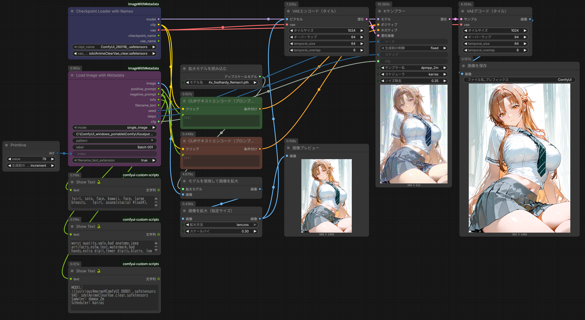
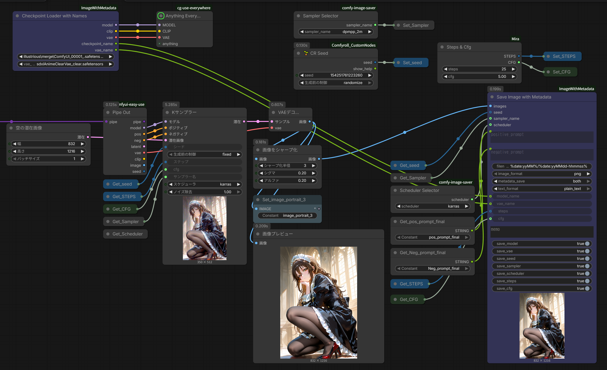
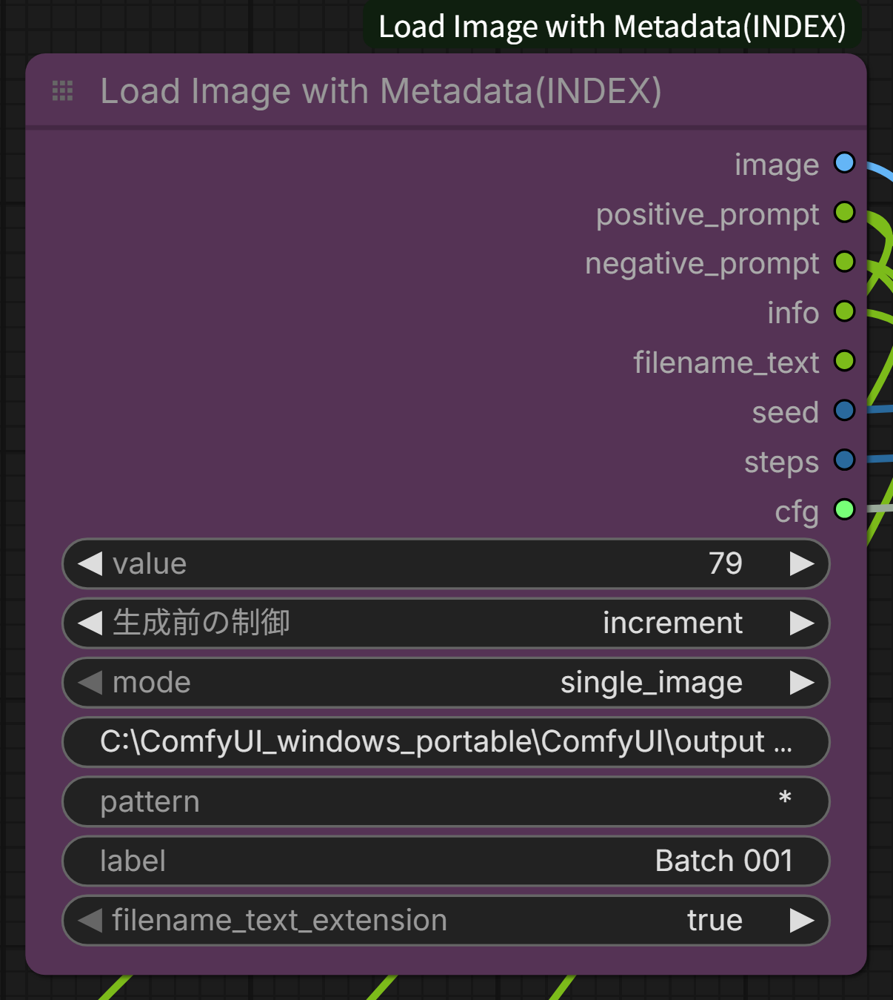

# ComfyUI ImageWithMetadata Nodes

[日本語版 README](README_ja.md) | **English**

Custom nodes for ComfyUI that enable batch image loading with metadata extraction and saving with comprehensive metadata embedding.

## Features

### Load Image with Metadata



- **Batch processing**: Load images sequentially from a folder
- **Metadata extraction**: Extract prompts, seed, steps, CFG from saved images
- **Two modes**: 
  - `single_image`: Load specific image by index
  - `incremental_image`: Auto-advance through folder
- **Multiple format support**: PNG, JPG, WebP, BMP, GIF
- **Based on WAS Node Suite**: Uses proven, stable code pattern
- **Loop support**: Automatically wraps to first image when reaching end

### Save Image with Metadata



- **Comprehensive metadata**: Save all generation parameters
- **Multiple formats**: PNG, WebP, JPG
- **Dual output**: PNG metadata + optional text file
- **Flexible text format**: JSON or plain text
- **Date-based naming**: Automatic folder organization by date

### Checkpoint Loader with Names
- **Model name output**: Returns checkpoint name as STRING
- **VAE name output**: Returns VAE name as STRING
- **Baked VAE support**: Option to use checkpoint's baked VAE
- **Connect to Save node**: Pass model/VAE names to SaveImageWithMetadata

## Installation

1. Clone or download this repository into your ComfyUI custom_nodes folder:
```bash
cd ComfyUI/custom_nodes/
git clone https://github.com/YOUR_USERNAME/ComfyUI-ImageWithMetadata.git ImageWithMetadata
```

2. Restart ComfyUI

No additional dependencies required - uses ComfyUI's built-in libraries.

## Usage

For detailed usage instructions, see [USAGE_en.md](USAGE.md) (English) or [USAGE_ja.md](USAGE_ja.md) (日本語).

### Quick Start: Batch Upscaling

**Recommended Pattern: Group Node with Integer Counter**

1. Add **Integer** node
   - Set `control_before_generate`: increment
2. Add **Load Image with Metadata**
   - Set `mode`: single_image
   - Set `path`: your image folder
   - Connect Integer output to `index` input
3. Select both nodes → Right-click → **Convert to Group**



This creates a unified batch processing node!

### Load Image with Metadata

**Key Parameters:**
- `mode`: single_image (with external counter) or incremental_image
- `path`: Image folder path
- `pattern`: File filter (* = all files)
- `label`: Batch identifier
- `index`: Starting position (0-based)

**Outputs:**
- image, positive_prompt, negative_prompt, info, filename_text, seed, steps, cfg

### Save Image with Metadata

**Key Parameters:**
- `filename_prefix`: Supports date format like `%date:yyMMdd-hhmmss%`
- `metadata_save`: png_metadata_only / text_file_only / both
- `text_format`: json / plain_text

Connect generation parameters from other nodes for complete metadata capture.

## Mode Comparison

### incremental_image Mode
- Always starts from last position
- Cannot start from middle (e.g., image #50)
- Best for: Complete folder processing from start

### single_image Mode + External Counter (Recommended)
- Start from any position
- See current index value
- Manually adjust if needed
- Best for: Flexible batch processing

## Examples

### Example: img2img Batch Processing
```
Integer (increment, value=50)  ← Start from 51st image
  ↓
Load Image with Metadata (single_image)
  ├→ image → VAE Encode → KSampler
  ├→ positive_prompt → CLIP Text Encode
  └→ negative_prompt → CLIP Text Encode
```

## Metadata Format

### Text File (JSON)
```json
{
  "positive_prompt": "1girl, solo, ...",
  "negative_prompt": "worst quality, ...",
  "model": "model_name.safetensors",
  "vae": "vae_name.pt",
  "seed": 123456789,
  "sampler_name": "dpmpp_2m",
  "scheduler": "karras",
  "steps": 20,
  "cfg": 7.0
}
```

### Text File (Plain Text)
```
Model: model_name.safetensors
VAE: vae_name.pt
Seed: 123456789
Sampler: dpmpp_2m
Scheduler: karras
Steps: 20
CFG: 7.0
Positive: =======================================
1girl, solo, ...
Negative: =======================================
worst quality, ...
```

## Troubleshooting

### Images not loading
- Check if path exists
- Verify pattern matches files (use `*` for all)
- Check console for error messages

### Slow performance
- This is expected for large batches
- Use single_image + Integer for better control

### Metadata not extracted
- Ensure images were saved with metadata
- Check if text file exists (filename.txt)
- Supported formats: This node's format, A1111 format

## Credits

Based on **WAS Node Suite** by WASasquatch:
- https://github.com/WASasquatch/was-node-suite-comfyui
- Licensed under MIT License

## License

MIT License - See [LICENSE](LICENSE) file for details.

## Support Policy

This is a personal project with limited support. See README for full disclaimer.

**Provided:**
- ✅ Open source code
- ✅ Basic documentation
- ✅ Community discussions

**Not guaranteed:**
- Individual support
- Bug fixes
- Future compatibility

**Disclaimer:** Provided "as is" without warranty. Use at your own risk.

## Changelog

### v1.0.0 (2026-01-25)
- Initial release
- Load Image with Metadata node
- Save Image with Metadata node
