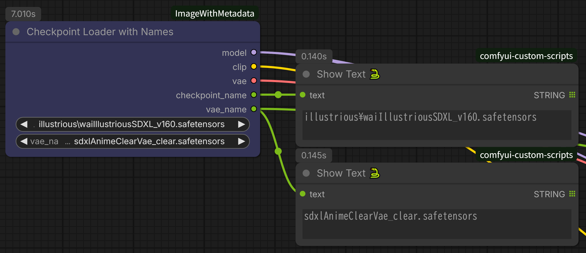
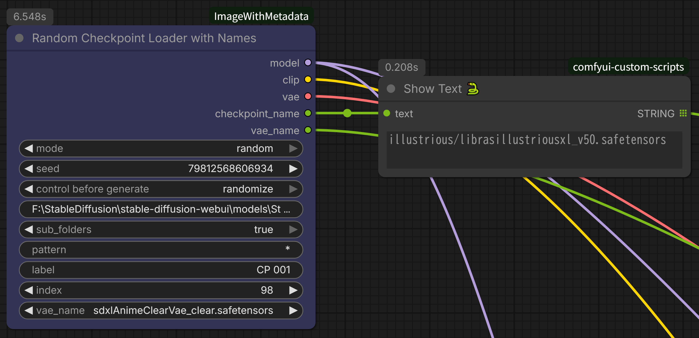

# ComfyUI ImageWithMetadata ノード

**日本語** | [English README](README.md)

ComfyUI用のカスタムノードで、メタデータ抽出機能付きバッチ画像読み込みと、包括的なメタデータ埋め込み付き画像保存を実現します。

## 機能

### Load Image with Metadata（メタデータ付き画像読み込み）


- **バッチ処理**: フォルダ内の画像を順次読み込み
- **メタデータ抽出**: 保存された画像からプロンプト、seed、steps、CFGを抽出
- **2つのモード**: 
  - `single_image`: indexで指定した画像を読み込み
  - `incremental_image`: フォルダ内を自動で順次処理
- **複数フォーマット対応**: PNG、JPG、WebP、BMP、GIF
- **WAS Node Suite ベース**: 実績のある安定したコードパターンを使用
- **ループ対応**: 最後の画像に到達したら自動的に最初に戻る

### Save Image with Metadata（メタデータ付き画像保存）


- **包括的なメタデータ**: すべての生成パラメータを保存
- **複数フォーマット**: PNG、WebP、JPG
- **二重出力**: PNGメタデータ + オプションのテキストファイル
- **柔軟なテキスト形式**: JSONまたはプレーンテキスト
- **日付ベースの命名**: 日付による自動フォルダ整理

### Checkpoint Loader with Names（名前付きチェックポイントローダー）



- **モデル名出力**: チェックポイント名をSTRINGとして出力
- **VAE名出力**: VAE名をSTRINGとして出力
- **Baked VAE対応**: チェックポイント内蔵VAEを使用するオプション
- **Saveノードと接続**: モデル/VAE名をSaveImageWithMetadataに渡す

### Random Checkpoint Loader with Names（ランダムチェックポイントローダー）




- **2つのモード**: 
  - `single`: 外部indexで順次切り替え（バッチ処理）
  - `random`: seedベースのランダム選択
- **フォルダ指定**: 特定フォルダ以下のチェックポイントのみ選択
- **サブフォルダ対応**: サブフォルダ内のモデルも検索可能
- **パターンフィルタ**: ファイル名でフィルタリング（例: `anime_*`）
- **BaseModel別管理**: SDXL/SD1.5/Illustriousなどを分けて使用可能
- **名前出力**: モデル名とVAE名をSTRINGで出力

## インストール

1. ComfyUIのcustom_nodesフォルダにこのリポジトリをクローンまたはダウンロード:
```bash
cd ComfyUI/custom_nodes/
git clone https://github.com/shin131002/ComfyUI-ImageWithMetadata.git ImageWithMetadata
```

2. ComfyUIを再起動

追加の依存関係は不要 - ComfyUIの組み込みライブラリを使用します。

## 使い方

詳細な使用方法は [USAGE_ja.md](USAGE_ja.md)（日本語）または [USAGE.md](USAGE.md) (English) を参照してください。

### クイックスタート: バッチアップスケール

**推奨パターン: Integerノードとのグループ化**

1. **Integerノード**を追加
   - `control_before_generate`: increment に設定
2. **Load Image with Metadata**を追加
   - `mode`: single_image に設定
   - `path`: 画像フォルダのパスを設定
   - Integer の出力を `index` 入力に接続
3. 両方のノードを選択 → 右クリック → **Convert to Group**


これで統合されたバッチ処理ノードが完成！

### Load Image with Metadata

**主なパラメータ:**
- `mode`: single_image（外部カウンター使用）または incremental_image
- `path`: 画像フォルダのパス
- `pattern`: ファイルフィルタ（* = すべてのファイル）
- `label`: バッチ識別子
- `index`: 開始位置（0始まり）

**出力:**
- image, positive_prompt, negative_prompt, info, filename_text, seed, steps, cfg

### Save Image with Metadata

**主なパラメータ:**
- `filename_prefix`: `%date:yyMMdd-hhmmss%` のような日付フォーマットをサポート
- `metadata_save`: png_metadata_only / text_file_only / both
- `text_format`: json / plain_text

完全なメタデータキャプチャのため、他のノードから生成パラメータを接続できます。

## モード比較

### incremental_image モード
- 常に前回の続きから開始
- 途中（例: 50枚目）からの開始は不可
- 用途: フォルダ全体を最初から順番に処理

### single_image モード + 外部カウンター（推奨）
- 任意の位置から開始可能
- 現在のindex値を確認可能
- 必要に応じて手動調整可能
- 用途: 柔軟なバッチ処理

## 使用例

### 例1: 複数モデルで自動バッチ生成
```
Integer (increment, value=0)
  ↓
Random Checkpoint Loader with Names (single mode)
  ├→ path: F:\models\SDXL
  ├→ index: ← Integer接続
  ├→ checkpoint_name → Save Image with Metadata
  └→ MODEL, CLIP, VAE → KSampler
```

### 例2: 自動アップスケールワークフロー
```
Integer (increment, value=0)
  ↓
Load Image with Metadata (single_image)
  ↓
Upscale Model
  ↓
Save Image with Metadata
```

### 例3: img2imgバッチ処理
```
Integer (increment, value=50)  ← 51枚目から開始
  ↓
Load Image with Metadata (single_image)
  ├→ image → VAE Encode → KSampler
  ├→ positive_prompt → CLIP Text Encode
  └→ negative_prompt → CLIP Text Encode
```

## メタデータ形式

### テキストファイル（JSON）
```json
{
  "positive_prompt": "1girl, solo, ...",
  "negative_prompt": "worst quality, ...",
  "model": "model_name.safetensors",
  "vae": "vae_name.pt",
  "seed": 123456789,
  "sampler_name": "dpmpp_2m",
  "scheduler": "karras",
  "steps": 20,
  "cfg": 7.0
}
```

### テキストファイル（プレーンテキスト）
```
Model: model_name.safetensors
VAE: vae_name.pt
Seed: 123456789
Sampler: dpmpp_2m
Scheduler: karras
Steps: 20
CFG: 7.0
Positive: =======================================
1girl, solo, ...
Negative: =======================================
worst quality, ...
```

## トラブルシューティング

### 画像が読み込まれない
- パスが存在するか確認
- patternがファイルにマッチするか確認（全て対象なら `*`）
- コンソールでエラーメッセージを確認

### パフォーマンスが遅い
- 大量バッチでは正常な動作
- single_image + Integer で より良い制御が可能

### メタデータが抽出されない
- 画像がメタデータ付きで保存されているか確認
- テキストファイル（filename.txt）が存在するか確認
- 対応形式: このノードの形式、A1111形式

## クレジットとライセンス

このプロジェクトは WASasquatch による **WAS Node Suite** をベースにしています。
- リポジトリ: https://github.com/WASasquatch/was-node-suite-comfyui
- ライセンス: MIT License

`LoadImageWithMetadata` ノードは、WAS Node Suite の `BatchImageLoader` パターンにメタデータ抽出機能を追加したものです。

## ライセンス

MIT License - 詳細は LICENSE ファイルを参照してください。

このソフトウェアを使用または配布する際は、以下の両方への帰属表示を維持してください:
- このプロジェクト
- WAS Node Suite（元の BatchImageLoader 実装）

## サポートポリシー

これは個人プロジェクトとして無償で提供されており、限定的なサポートとなります:

**提供しないもの:**
- 個別のテクニカルサポート
- バグ修正・機能追加の保証
- 将来のComfyUIアップデートへの対応保証

**提供するもの:**
- ✅ オープンソースコード（自由に改変・フォーク可能）
- ✅ 基本的なドキュメント
- ✅ GitHubディスカッションの場（返答の保証なし）

**問題が発生した場合:**
1. このREADMEとUSAGE_ja.md/USAGE.mdを確認
2. 既存のissueを検索
3. 新しいissueを開く（対応は保証されません）
4. 自分でフォークして修正（MITライセンス）

**免責事項:** このソフトウェアは「現状のまま」提供され、いかなる保証もありません。作者は、このソフトウェアの使用によって生じたいかなる損害についても責任を負いません。

## 貢献

IssuesとPull Requestsは歓迎しますが、時間的制約により対応時間が変動する可能性があることをご了承ください。

## 変更履歴

### v1.1.0 (2026-01-26)
- Random Checkpoint Loader with Names ノード追加
  - single/randomモードでチェックポイントを切り替え
  - フォルダ指定・サブフォルダ対応
  - パターンフィルタ機能
  - BaseModel別管理に対応

### v1.0.0 (2026-01-25)
- 初回リリース
- Load Image with Metadata ノード
- Save Image with Metadata ノード
- Checkpoint Loader with Names ノード
- WAS Node Suite の BatchImageLoader パターンをベースに実装
